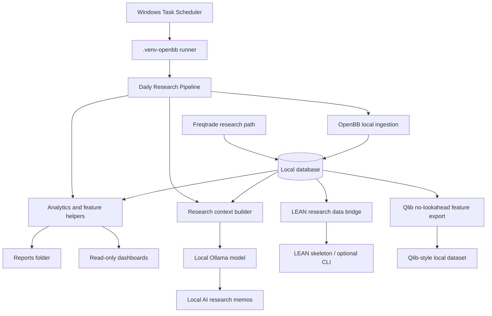

# Architecture

## System Diagram



## Data Flow

OpenBB local data is ingested into the database and optional local files. Analytics and feature modules read those rows and produce summaries, feature datasets, reports, and dashboard tables.

```text
OpenBB local data -> DB -> analytics/features -> engines -> reports/dashboard
```

## Local AI Flow

```text
DB/report context -> prompt builder -> Ollama local HTTP endpoint -> memo DB row -> reports/local_ai/
```

The Local AI path is local-only. It does not use OpenAI API, ChatGPT OAuth, cookies, or browser automation.

## Daily Pipeline Flow

```text
Windows scheduler -> scripts/run_daily_research_venv.ps1
                  -> scripts/run_daily_research.py
                  -> OpenBB refresh
                  -> analytics report
                  -> Local AI memo
                  -> daily_research_runs
```

The scheduler launches the research workflow; it does not place orders.

## LEAN Flow

```text
OpenBB local data -> LEAN research bridge CSVs -> LEAN-style skeleton -> optional local LEAN CLI
```

The bridge and skeleton are available. Executable LEAN backtest remains unverified after Docker/runtime timeout. No cloud login or brokerage configuration is used.

## Qlib Flow

```text
OpenBB local data -> no-lookahead feature builder -> Qlib-style dataset export -> optional Qlib trainer
```

Features use historical/current values only. `label_forward_return_5d` is a separated label. Qlib package is currently missing, so true Qlib trainer execution is future work.

## Safety Layer

Safety is enforced through config defaults, validation helpers, tests, audits, and dashboard wording:

- live trading disabled;
- futures disabled;
- leverage disabled;
- real orders disabled;
- brokerage/cloud credentials disabled;
- OpenAI API and ChatGPT OAuth disabled.

## Storage

- `database/`: schema definition.
- `data/openbb/`: ingested local market data files.
- `data/generated/lean/`: LEAN research bridge exports and skeletons.
- `data/generated/qlib/`: Qlib-style datasets.
- `reports/`: analytics, Local AI memos, daily research, LEAN, Qlib, Control Center, and health reports.
- `configs/`: research-only engine and workflow configuration.
